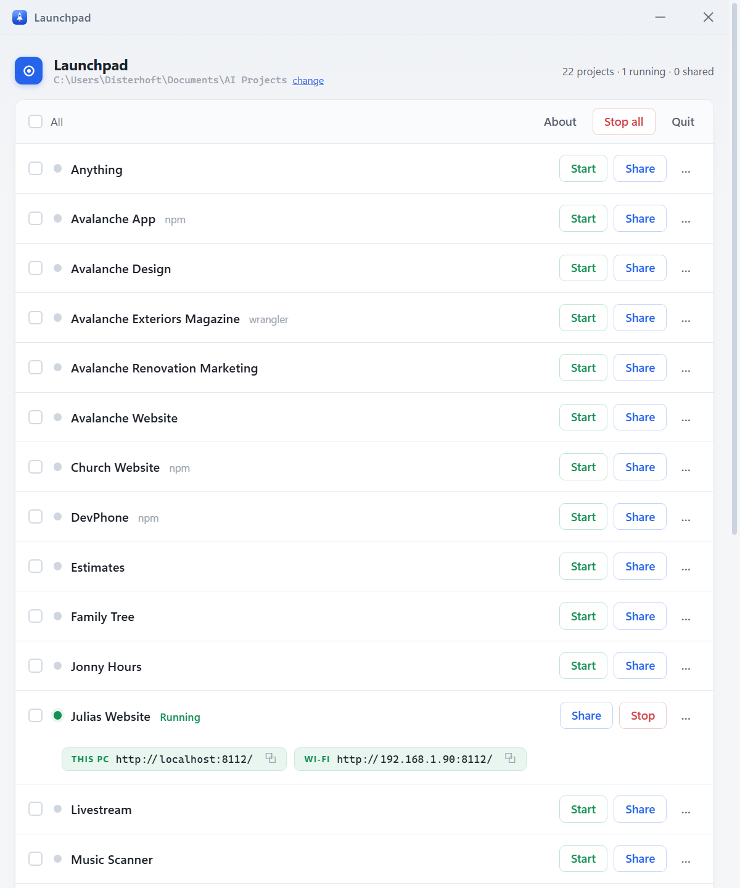
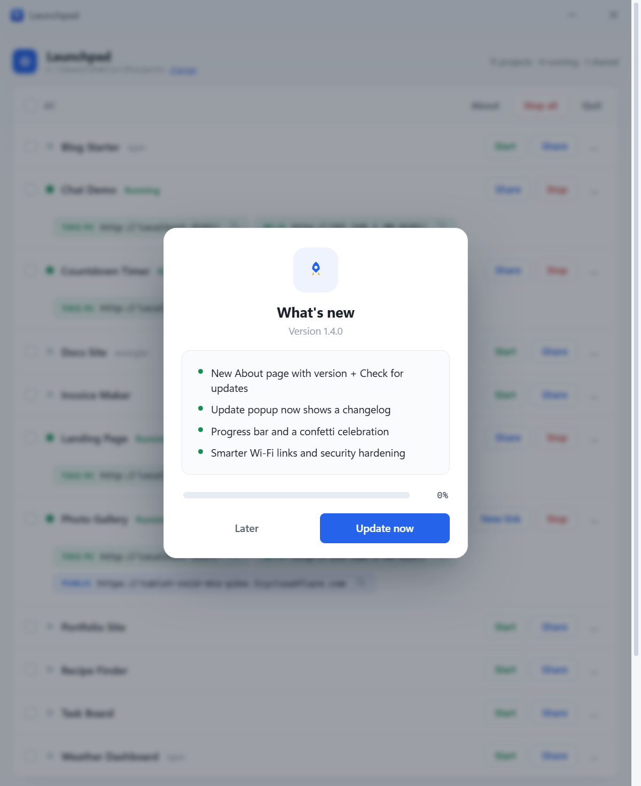
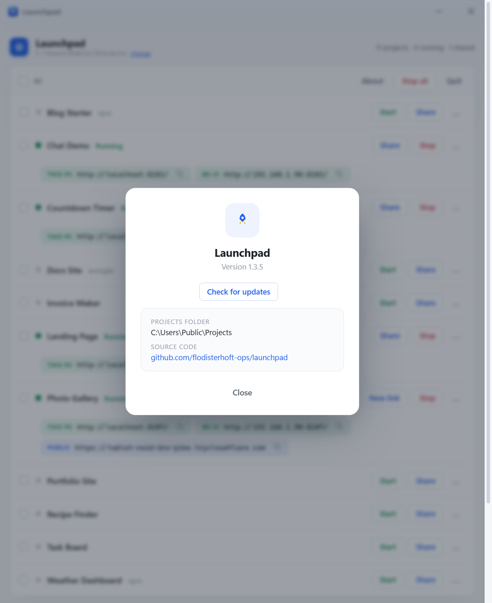
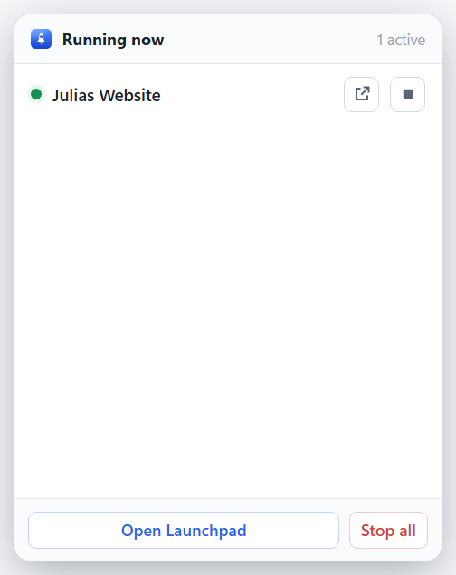

<div align="center">


# Launchpad

**Start local web apps and sites with one click — then share them with a temporary public link.**

A tiny Windows desktop app for developers working on local web projects. Point
it at your projects folder and it finds apps and sites it knows how to
serve, starts the right local server, and gives you links for this computer,
devices on the same local network, or anyone on the internet through a
temporary Cloudflare Quick Tunnel. It lives in your system tray and keeps
itself up to date.



</div>

---

## Why

Local development gets messy fast: static folders, npm dev servers, Wrangler
projects, changing ports, phone testing, and temporary links for clients or
teammates. Launchpad turns that workflow into one list of buttons.

- **▶ Start** — starts the project locally and gives you a `localhost` link,
  plus a local-network link when other devices can reach it.
- **⇗ Share** — creates a temporary public `https://…trycloudflare.com` link to
  the running local project. Great for showing a client or teammate, or testing
  camera/GPS on a real phone.
- Handles plain HTML/CSS/JS folders, `npm run dev` / `npm start` projects, and
  Cloudflare Pages/Wrangler projects — it detects the right way to serve each
  one.

## Features

|  |  |
|---|---|
| 🗂️ **Web projects in one list** | Point it at your projects folder; Launchpad finds every project inside — top-level or nested — and remembers your choices. New projects appear automatically. |
| 📱 **Device-ready testing** | `localhost` and local-network links for nearby devices; public HTTPS links when browser APIs need a secure real-device URL. |
| 🔗 **One-click sharing** | Public links via Cloudflare Quick Tunnels — one click, fresh link, no Cloudflare account required. |
| 🎯 **Smart detection** | Static sites, `npm run dev` / `npm start`, and `wrangler pages dev` all get the right local server. |
| 🖥️ **Lives in the tray** | Close the window and local servers keep running; a tray panel gives you quick controls. |
| 🚀 **Auto-updates** | Checks for new versions, shows a changelog, updates itself. |

## Screenshots

<div align="center">

<table>
<tr>
<td width="50%"><br><sub><b>Auto-update</b> — a “What’s new” popup, a progress bar, then an automatic install and restart.</sub></td>
<td width="50%"><br><sub><b>About</b> — version, one-click “Check for updates”, and your projects folder.</sub></td>
</tr>
</table>



<sub><b>Tray panel</b> — see what’s running, open or copy links, or stop a project without reopening the window.</sub>

</div>

## Install

> **Windows only.** Launchpad ships as a Windows installer and relies on
> Windows tools under the hood (`taskkill`, PowerShell, the Windows build of
> `cloudflared`), so it does not run on macOS or Linux today.

1. Download the latest **`Launchpad-Setup.exe`** from
   [Releases](https://github.com/flodisterhoft-ops/launchpad/releases/latest).
2. Run it — it installs just for you (no admin) and adds a **Launchpad** shortcut.
3. Open Launchpad and click **change** to point it at the folder where your
   projects live.

> First run shows a Windows SmartScreen notice (the app isn’t code-signed):
> **More info → Run anyway**. The first time you **Start** a project, allow the
> firewall prompt so devices on your local network can reach the local server.

Plain HTML/CSS/JS sites and sharing work out of the box. Projects that use
`npm` or `wrangler` need [Node.js](https://nodejs.org) installed — Launchpad
tells you when that’s the case.

## Using it

- **Start / Share** one project, or tick several (or **All**) and act on them at once.
- **Filter** box at the top narrows a long list as you type.
- **New link** swaps a public link for a fresh one.
- **…** opens a project's details — raw server output, plus **Open folder** and **Hide**.
  Hidden projects come back via the *“N hidden — show all”* link.
- Closing the window keeps local servers and public links running in the tray. **Single-click** the
  tray icon for the quick panel, **double-click** to reopen the window.
- **Quit** (in-app or the tray menu) stops all local servers and public links.

## Auto-update

Launchpad keeps itself current — you never re-download it:

1. It checks for a new version on launch and every few hours (or on demand from
   **About → Check for updates**).
2. A **What’s new** popup lists the changes.
3. **Update now** downloads, installs, and restarts Launchpad on the new version.

---

## For developers

The app is [Electron](https://www.electronjs.org/); project detection, local
servers, sharing tunnels, and the dashboard API live in a small plain-Node
control server (`server.js`).

```bash
npm install
npx electron .          # run the app from source
node server.js          # or just the server, opened in a browser tab
npm test                # run the unit tests (Node's built-in runner)
```

| File | Role |
|---|---|
| `server.js` | Control server — detects projects, starts local servers/tunnels, serves the UI & API |
| `public/index.html` / `public/app.js` | The dashboard markup/styles and renderer logic |
| `public/tray.html` | The tray quick panel |
| `electron-main.js` / `preload.js` | Electron shell — window, tray, auto-updater |
| `publish.mjs` | Build + release to GitHub with a changelog |
| `make-icon.py` / `capture.js` | Regenerate the icon / the screenshots above |

### Publishing an update

```bash
node publish.mjs patch                      # 1.3.x -> 1.3.(x+1), build + release
node publish.mjs minor                      # -> 1.4.0
node publish.mjs patch "Fixed X" "Added Y"  # with an explicit changelog
```

It bumps the version, builds the installer, bakes a **changelog** into the
update feed (auto from your commit messages, or the notes you pass) and the
GitHub release, uploads everything via the `gh` CLI, and tags it. Every
installed copy shows that changelog and updates on its own.

## Tech

Electron · Node (no runtime dependencies beyond the updater) · Cloudflare Quick
Tunnels · electron-builder + electron-updater · GitHub Releases as the update feed.

## Roadmap

Curious what's next — like permanent, bookmarkable links for projects you work on
often? See **[ROADMAP.md](ROADMAP.md)**.

## Support

Launchpad is free and open source. If it saves you time, you can support it:

- ☕ [**Buy me a coffee**](https://buymeacoffee.com/flodisterhoft)
- 💛 [**GitHub Sponsors**](https://github.com/sponsors/flodisterhoft-ops)

## License

[MIT](LICENSE) © Florian Disterhoft

<div align="center"><sub>Built for developers who need to start, test, and share local apps and sites quickly. 🚀</sub></div>
